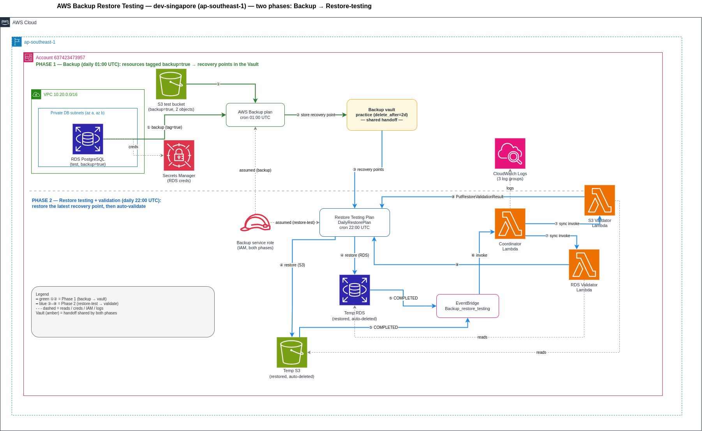

<!--
  Infrastructure Document (living doc) — produced by /infra-document (Stage 5).
  Every fact is derived from the spec + Terraform code. Re-run the skill when infra changes.
-->

# Infrastructure — AWS Backup Restore Testing / dev-singapore

- **Environment:** `dev` (dir `environments/dev-singapore`)   **Region:** `ap-southeast-1`   **Account:** `637423473957`
- **Source of truth:** Terraform at `environments/dev-singapore` · Spec: [`specs/terraform-spec.md`](specs/terraform-spec.md)
- **Last generated:** 2026-06-05 by `/infra-document` (living document — re-run after changes)

## 1. Overview
- **Purpose:** A lab that provisions an **AWS Backup restore-testing** apparatus (ported 1:1 from the AWS blog CloudFormation `CFAWSBackupRestoreTestingV15.yaml`) plus supporting resources so it runs end-to-end from zero. It periodically restores recovery points and validates them automatically via Lambda.
- **Stack:** AWS Backup (vault / plan / restore-testing plan / selections), Lambda (Python 3.12 ×3), RDS PostgreSQL, S3, EventBridge, CloudWatch Logs, IAM, Secrets Manager, VPC.
- **Two parts:** **Part A** = the restore-testing apparatus (module `backup-restore-testing`, 1:1 CFN port). **Part B** = supporting vault + backup plan + test RDS/S3 that generate the recovery points to test.
- **Scope of this doc:** this environment only (`dev-singapore`); the single env for this lab.

## 2. Architecture diagram

```mermaid
flowchart LR
  subgraph AWS["AWS Cloud — ap-southeast-1 (acct 637423473957)"]
    subgraph VPC["VPC 10.20.0.0/16"]
      subgraph PRV["Private DB subnets (az a, az b)"]
        rds[(RDS PostgreSQL&#10;test, tag backup=true)]
      end
    end
    s3[("S3 test bucket&#10;tag backup=true, 2 objects")]
    secrets[[Secrets Manager&#10;RDS creds]]

    plan["AWS Backup plan&#10;cron 01:00 UTC"]
    vault[("Backup vault&#10;practice, delete_after=2d")]
    rtp["Restore Testing Plan&#10;DailyRestorePlan cron 22:00 UTC"]
    restored[/"Restored resource&#10;(temp RDS / S3)"/]
    eb{{"EventBridge&#10;Backup_restore_testing"}}
    coord[Coordinator Lambda]
    vs3[S3 Validator Lambda]
    vrds[RDS Validator Lambda]
    cw[[CloudWatch Logs]]

    plan -->|"① back up tagged"| vault
    rds -. backed up .-> plan
    s3 -. backed up .-> plan
    rtp -->|"② restore latest RP"| restored
    vault -. recovery points .-> rtp
    restored -->|"③ COMPLETED"| eb
    eb -->|"④ invoke"| coord
    coord -->|"⑤ sync invoke"| vs3
    coord -->|"⑤ sync invoke"| vrds
    vs3 -->|"⑥ PutRestoreValidationResult"| rtp
    vrds -->|"⑥ PutRestoreValidationResult"| rtp
    vs3 -. reads .-> restored
    vrds -. reads .-> restored
    rds -. creds .-> secrets
    coord -. logs .-> cw
  end
```

<!-- ^ PNG not exported yet. Source: diagrams/infra.drawio (open in draw.io → Export → PNG). -->

<!-- VERIFICATION DIAGRAM — delete after confirming infra.drawio matches, then export drawio → infra.png -->

<!-- END VERIFICATION DIAGRAM -->

## 3. Components
| Module / resource | AWS resource(s) | Role | Tier / subnet |
|-------------------|-----------------|------|---------------|
| `module.network` *(enable_rds)* | VPC `10.20.0.0/16`, 2 database subnets (az a/b), DB subnet group, route table; **no IGW/NAT** | Network foundation for the test DB | — (private only) |
| `module.rds` *(enable_rds)* | `aws_db_instance` (PostgreSQL 17.6, `db.t4g.micro`, encrypted, single-AZ, **not public**), SG (deny-all egress), Secrets Manager secret (auto-gen password), parameter group, log groups | Test database; tagged `backup=true` | private DB subnets |
| `module.test_bucket` (`s3_backend_storage`) *(enable_s3)* | `aws_s3_bucket` (versioned, SSE-S3/AES256, public-access-block, `force_destroy`, lifecycle expire noncurrent 7d) | Test bucket; tagged `backup=true` | — |
| `aws_s3_object.sample` ×2 *(enable_s3)* | 2 objects under `validation/` | Make `object_count > 1` so the S3 validator passes | — |
| `aws_backup_vault.practice` | Backup vault (AWS-managed `aws/backup` KMS) | Holds recovery points | — |
| `aws_backup_plan.practice` | Backup plan, rule `cron(0 1 * * ? *)`, `delete_after = 2` | Creates recovery points from `backup=true` resources | — |
| `aws_backup_selection.practice` | Selection by tag `backup=true`, uses backup-service role | Tells the plan what to back up | — |
| `module.backup_restore_testing` (**Part A**) | Restore-testing plan `DailyRestorePlan` (`cron(0 22 ? * * *)`), S3 + RDS restore-testing selections, 3× Lambda, EventBridge rule/target/permission, 3× CloudWatch log group, 4× IAM role | The restore-testing + auto-validation apparatus | — |

**IAM roles (in `module.backup_restore_testing`):** `backup_service` (trust `backup.amazonaws.com`, 4 managed policies — also used by Part B selection), `coordinator` (invoke scoped to validator ARNs), `validator_s3`, `validator_rds`.

**Lambdas (Python 3.12, 60s, 128MB):** `RestoreValidationCoordinator`, `S3RestoreValidation` *(enable_s3)*, `RDSRestoreValidation` *(enable_rds)*.

## 4. Network
- **VPC CIDR:** `10.20.0.0/16` · **AZs:** `ap-southeast-1a`, `ap-southeast-1b` (database subnets `10.20.101.0/24`, `10.20.102.0/24`).
- **Subnets:** database/private only — there are **no public subnets**, no IGW, no NAT (the test DB needs no internet path).
- **Security groups:** RDS SG — ingress only from `restricted_security_group_ids` (none here), **egress deny-all by default** (`egress_rules = []`).
- **Egress / endpoints:** none. VPC endpoints not provisioned (no workloads call AWS APIs from the VPC).
- *Network exists only when `enable_rds = true`.*

## 5. Data flow
1. **① Backup** — `aws_backup_plan.practice` (cron 01:00 UTC) backs up all `backup=true`-tagged resources (test RDS + test S3) into `aws_backup_vault.practice` as recovery points.
2. **② Restore test** — `DailyRestorePlan` (cron 22:00 UTC) picks the latest recovery point within the 7-day selection window and restores it to a temporary resource.
3. **③ Event** — on restore job `COMPLETED`, EventBridge rule `Backup_restore_testing` (filters `detail.status` + `restoreTestingPlanArn` prefix) fires.
4. **④ Coordinate** — the rule invokes the **coordinator** Lambda.
5. **⑤ Validate** — coordinator synchronously (`RequestResponse`) invokes the S3 or RDS validator by `resourceType`.
6. **⑥ Report** — validator checks the restored resource (S3: `object_count > 1`; RDS: `DBInstanceStatus == "available"`) and calls `backup:PutRestoreValidationResult` (`SUCCESSFUL`/`FAILED`).
(Numbers match the diagram edges.)

## 6. Environments & naming
- **Prefix:** `${environment}-${app_name}` → **`dev-restore-lab`** (resource names like `dev-restore-lab-vault`, `dev-restore-lab-test`). Fixed CFN-derived names are kept exact: `DailyRestorePlan`, `RestoreValidationCoordinator`, `S3RestoreValidation`, `RDSRestoreValidation`, `Backup_restore_testing`.
- **State:** S3 backend, `key = "dev-singapore/terraform.tfstate"`, `use_lockfile = true`. Account-specific values are in **`backend-dev.hcl`** (gitignored) — init with `terraform init -backend-config=backend-dev.hcl`.
- **Provider:** `aws >= 6.0.0, < 7.0.0` (resolved v6.48.0); `archive`, `random`. Toggles: `enable_s3`, `enable_rds` (both `true`).
- **Sibling environments:** none (single-env lab).

## 7. Security posture
- **IAM:** all policies via `data.aws_iam_policy_document` (no inline JSON). Coordinator's `lambda:InvokeFunction` is scoped to the enabled validator ARNs. Validator S3 read scoped to `aws-backup-restore-*` buckets. `backup:PutRestoreValidationResult` / `rds:DescribeDBInstances` use `*` (no resource-level scoping available — matches CFN).
- **Encryption at rest:** RDS `storage_encrypted = true`; S3 SSE-S3 (AES256) + public-access-block + versioning; backup vault uses AWS-managed `aws/backup` key. (CMK is a documented future option, not used in the lab.)
- **Secrets:** RDS master password is auto-generated into **Secrets Manager** (never in tfvars/state inputs). No hardcoded secrets.
- **Network:** RDS is private (not publicly accessible), SG egress deny-all.
- **Edge protection:** n/a (no public ingress; this is an internal backup-validation system).
- **Review:** latest `/infra-review` → **GO** (deep run 2026-06-05). 0 Critical, 0 High after fixes (both Highs — `tfplan` exposure, hardcoded account ID in backend — remediated). Open items are Medium/Low hardening (CMK/KMS, IAM DB auth, default NACL/SG, IAM wildcard scoping). Report: [`reviews/dev-singapore-2026-06-05.md`](reviews/dev-singapore-2026-06-05.md).

## 8. Cost summary
| Item | Config | Cost/month (est.) |
|------|--------|--------------------|
| Test RDS (always-on) | `db.t4g.micro` PostgreSQL, single-AZ, 20GB gp3 | ~$11–14 |
| RDS restore-testing runs | 1 restored instance/day × ~4h + temp storage | ~$2–4 |
| Backup storage | RDS + S3 snapshots, 2-day retention | ~$1–2 |
| Lambda (×3) | few invokes/day, 128MB/60s | ~$0 (free tier) |
| CloudWatch Logs | 7-day retention | ~$0–1 |
| S3 test bucket | few objects + versioning | ~$0 |
| **Total (est.)** | | **~$15–22/mo if left running** |
- **Savings levers (from review):** `terraform destroy` after each session (~$18/mo); `enable_rds=false` for the cheap S3-only path (~$15/mo). See spec §15 and the review report.

## 9. Operations
- **Deploy:** manual Terraform — `terraform init -reconfigure -backend-config=backend-dev.hcl` → `terraform plan -out=tfplan` → `terraform apply tfplan`. No CI/CD.
- **Lab sequencing:** day 0 has no recovery point — run an on-demand backup right after apply: `aws backup start-backup-job …` so restore-testing has a point within the 7-day window.
- **Monitoring:** CloudWatch Logs for the 3 Lambdas (`/aws/lambda/RestoreValidationCoordinator`, `/aws/lambda/S3RestoreValidation`, `/aws/lambda/RDSRestoreValidation`); results in AWS Backup console → Restore testing.
- **Incidents:** check the validator log groups + restore job status. Restore job fails if the RDS subnet group is missing/invalid (wired via `rds_subnet_group_name`).
- **Rollback / teardown:** `terraform destroy`. S3 test bucket has `force_destroy = true`; vault won't delete until recovery points hit `delete_after = 2` or are removed manually.

## 10. How to regenerate / change log
- Regenerate: `/infra-document environments/dev-singapore` (living doc).
- After editing the diagram: open `diagrams/infra.drawio` → Export PNG → `diagrams/infra.png` → delete the Mermaid verification block in §2.
- **Change log:**
  - 2026-06-05 — initial document (post-review fixes: v6 provider, deny-all RDS egress, partial backend config, PostgreSQL 17.6, env validations).
